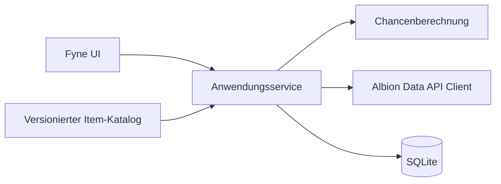

# Albion Helper – MVP-Umsetzungsplan

Stand: 2026-09-15

## Produktziel

Eine leichtgewichtige Windows-Desktop-App zeigt den vollständigen lokalen Albion-Online-Itemkatalog und profitable direkte Handelswege zwischen Märkten. Der Nutzer kann Items filtern, die aktuelle Tabellenseite laden und gespeicherte Ergebnisse sofort öffnen. Entwicklung, Tests und Builds laufen in Docker; das Ergebnis ist eine lokal startbare Windows-Anwendung. Linux und macOS bleiben spätere Plattformziele.

## Erfolgskriterium des MVP

Ein Nutzer kann die App starten, im vollständigen lokalen Itembestand filtern und für die passende Auswahl Preise in den ausgewählten Städten synchronisieren. Die Tabelle zeigt höchstens 50 Items pro Seite. Kategorien, gültige Varianten und verfügbare XML-Rezeptdaten sind im lokalen Go-Katalog verknüpft. Nach einem Neustart sind die zuletzt geladenen Preise ohne Netzwerkzugriff sichtbar.

## Festgelegter MVP-Umfang

- Desktop-UI in Go mit Fyne
- Serverauswahl: Europe, Americas und Asia
- Märkte: Thetford, Fort Sterling, Lymhurst, Bridgewatch, Martlock, Caerleon, Black Market und Brecilien
- Vollständiger lokaler Item-Katalog aus den bereitgestellten Item-IDs und vorhandenen deutschen Namen; bei fehlender Übersetzung wird Englisch, dann die ID verwendet. Go-Definitionen sind nach Kategorien gruppiert.
- Parent-Child-Kategorien, gültige Variantenbereiche und verfügbare Crafting-Rezepte aus den bereitgestellten XML-Daten
- Paginierte Tabelle mit 50 Items pro Seite; ein manueller Sync lädt alle Items, die den aktiven Itemfiltern entsprechen
- Stadt-Checkboxen unter den Filtern; Royal Cities sind vorausgewählt, Caerleon, Black Market und Brecilien zunächst abgewählt
- Ein unbeschränkter Sync wird verhindert und fordert zuerst einen Itemfilter, damit keine Anfrage für den vollständigen Katalog gestartet wird
- Aktuelle Buy- und Sell-Preise über `/api/v2/stats/prices/{item_ids}.json`
- Gebündelte Requests unterhalb des API-URL-Limits, begrenzte Request-Rate, Timeout und verständliche Fehleranzeige
- Speicherung der letzten Marktpreise und Sync-Zeitpunkte in SQLite
- Berechnung direkter Handelschancen
- Filter: Freitext, Kategorie, Tier 1–8, Enchantment 0–4, Range 1–5, Mindestgewinn, Mindest-ROI
- Sortierbare Ergebnistabelle
- Kurze, stille Make-Ziele für Formatierung, Tests, Verifikation und Windows-amd64-Build; Docker bleibt hinter dem Makefile verborgen
- Bei erfolgreichen Make-Läufen nur `Success`, bei Fehlern Ausgabe des relevanten Build-/Testlogs
- Windows amd64 als primäres und einzig verpflichtendes MVP-Distributionsziel

## Bewusste Vereinfachungen

- Gewinn ist im MVP der Brutto-Spread `Verkaufspreis - Kaufpreis`; ROI ist `Gewinn / Kaufpreis * 100`. Steuern, Marktgebühren, Transportkosten und Volumen werden sichtbar als nicht berücksichtigt bezeichnet.
- Als Kaufpreis gilt die niedrigste aktuelle Sell Order am Startmarkt. Als Verkaufspreis gilt die höchste aktuelle Buy Order am Zielmarkt.
- Chancen mit Preis `0`, identischem Markt oder nichtpositivem Spread werden nicht angezeigt. Eine Ausnahme ist Handel zwischen dem Caerleon-Spielermarkt und dem Black Market, da dies zwei Märkte am selben Ort sind.
- „Range“ ist die kürzeste Zahl von Etappen im Ring der fünf Royal Cities. Eine Verbindung von oder nach Caerleon/Black Market wird als eine gesonderte Etappe dargestellt; Brecilien wird mit Range 5 dargestellt. Diese Anzeige beeinflusst die Gewinnberechnung nicht.
- Qualität wird aus den API-Daten übernommen, ist im ersten UI-Filter aber noch nicht separat auswählbar.
- Die App empfängt im MVP keine Daten direkt vom Albion Online Data Client.
- Crafting-Kostenberechnung, Refining-Auswertung, Rücklaufboni, Historien, Routenoptimierung, Benachrichtigungen und automatische Hintergrund-Synchronisation sind nicht Teil des MVP.

## Technischer Schnitt



Die Anwendung bleibt ein einzelner Prozess. UI-Code ruft einen kleinen Anwendungsservice auf. API, SQLite und Berechnung liegen hinter schmalen Go-Interfaces, damit Netzwerk und Datenbank gezielt getestet werden können. Synchronisation läuft außerhalb des UI-Threads und meldet Fortschritt, Erfolg oder Fehler zurück.

Vorgesehene Verzeichnisstruktur:

```text
cmd/albion-helper/       Programmeinstieg
internal/app/            Anwendungsabläufe
internal/catalog/        Item-Katalog und Kategorien
internal/marketapi/      HTTP-Client, Batching, Limits
internal/storage/        SQLite-Schema und Queries
internal/arbitrage/      Berechnung und Filter
internal/ui/             Fyne-Fenster und View Models
assets/                  App-Icon und eingebettete Katalogdaten
```

## Lieferstrategie

| Meilenstein | Sichtbares Ergebnis | Grenze |
|---|---|---|
| M1 Walking Skeleton | Startbares Desktop-Fenster mit Filtern und Beispieltabelle aus Docker-Build | Kein Netzwerk, keine DB |
| M2 Offline-fähige Datenbasis | App startet mit Katalog und liest/schreibt Preise in SQLite | Noch kein echter Sync |
| M3 Echter Preis-Sync | Button lädt echte Preise gebündelt und zeigt Status/Fehler | Noch einfache Ergebnisdarstellung |
| M4 Nutzbarer Arbitrage-Viewer | Berechnung, Filter, Sortierung und Datenalter funktionieren zusammen | MVP-Funktionsumfang vollständig |
| M5 Auslieferbarer MVP | Sauberer Windows-amd64-Build, Kurzanleitung und Abnahmeprotokoll | Linux/macOS sowie Installer/Signatur folgen später |

Jeder Meilenstein muss separat ausführbar bleiben. M1 wird zuerst geliefert, damit UI und Cross-Build früh validiert werden. Danach wird keine neue Infrastruktur begonnen, bevor der aktuelle vertikale Pfad funktioniert.

## Qualitäts- und Abnahmegrenzen

- Preisberechnung verwendet Integer für Silberbeträge und vermeidet Rundungsfehler.
- Datenbankmigrationen sind idempotent; eine frische und eine bestehende DB starten erfolgreich.
- HTTP-Tests verwenden einen lokalen Testserver und verursachen keine externen Requests.
- Ein fehlgeschlagener Sync löscht keine vorhandenen Preise.
- UI bleibt während des Syncs bedienbar und verhindert parallele Sync-Läufe.
- Leere, veraltete und teilweise API-Antworten werden erkennbar dargestellt.
- Tests und Build sind über dokumentierte Make-Ziele reproduzierbar; Nutzer und Agenten müssen keine Docker-Befehle zusammensetzen.
- Erfolgreiche Make-Ziele schreiben nur eine kurze `Success`-Meldung. Bei Fehler wird der relevante, zuvor in einer temporären Logdatei gesammelte Output ausgegeben.

## Nichtfunktionale Budgets

- Keine Hintergrunddienste und keine Telemetrie.
- Erfolgreiche Standard-Builds und -Tests erzeugen keine ausführlichen Logs im Terminal oder KI-Kontext.
- Ein manueller Sync bleibt sicher unter den veröffentlichten API-Grenzen von 180 Requests/Minute und 300 Requests/5 Minuten.
- Die Tabellenanzeige umfasst höchstens 50 Items je Seite. Der Sync umfasst alle zum Itemfilter passenden IDs und filtert API-Antworten zusätzlich nach ausgewählten Städten; Requests werden URL-sicher gebündelt und auf 1 Request/Sekunde begrenzt.
- Ziel für normalen Leerlauf: keine dauerhafte CPU-Last; Speicherverbrauch wird vor MVP-Abnahme einmal gemessen und in `STATUS.md` dokumentiert, ohne vorab künstlich zu optimieren.

## Hauptrisiken und frühe Prüfungen

| Risiko | Frühe Gegenmaßnahme |
|---|---|
| Fyne-Cross-Build oder Grafikbibliotheken funktionieren im Container nicht | Bereits in M1 über `make build-windows` einen echten Windows-amd64-Build erzeugen und lokal starten lassen |
| Item-Metadaten enthalten Lücken | Alle IDs/Namen bleiben erhalten; fehlende XML-Kategorien werden als „Uncategorized“ markiert und fehlende Rezepte nicht erfunden |
| SQLite-Treiber erschwert Cross-Build | Treiberwahl in M2 mit Windows-Build prüfen; pure-Go bevorzugen |
| API liefert alte oder partielle Preise | Zeitstempel speichern, Datenalter zeigen und bestehende Daten bei Fehler behalten |
| Fachliche Begriffe Gewinn/Umsatz sind missverständlich | Spalten im MVP als „Bruttogewinn“ und „ROI (brutto)“ benennen |

## Entscheidungen nach dem MVP

Erst nach bestandener M5-Abnahme werden Crafting-Kostenberechnung/Refining, direkter Data-Client-Ingest, Gebührenprofile, weitere Plattformpakete oder automatische Updates priorisiert. Dafür wird kein Code im Voraus angelegt.
